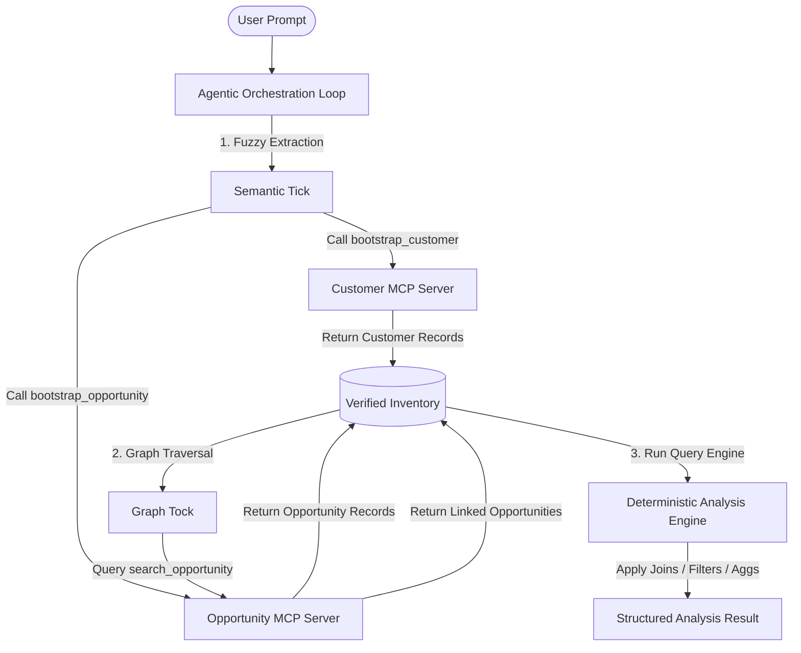

# Model Context Protocol (MCP) Contract Specification & Pluggability Analysis

This document details how the simulated MCP architecture in this repository maps to the official **Model Context Protocol (MCP)** specification, analyzes the feasibility of plugging actual MCP servers into this codebase, and provides a concrete migration blueprint.

---

## 1. Executive Summary

The current repository uses a simulated in-process "MCP" pattern where data sources (`Customer`, `Employee`, `Opportunity`) are represented as local Python modules, and relationships ("handshakes") are statically declared. 

An actual MCP setup decouples these data sources into independent, process-based JSON-RPC servers. 
* **Fuzzy discovery** (Phase 1: Semantic Tick) maps to MCP **Tools** (`bootstrap_<entity>`).
* **Graph traversal** (Phase 2: Graph Tock) maps to MCP **Tools** (`search_<entity>`).
* **Entity records** map to MCP **Resources** (`customer://<id>`, `opportunity://<id>`).
* **Schema discovery** maps to MCP **Resources** (`schema://Customer`).
* **Deterministic Analysis** (Phase 3) runs on the client-side using the resolved inventory fetched from these servers.

---

## 2. Current Architecture vs. Official MCP Standard

| Architectural Component | Current Simulated Setup | Official MCP Protocol Equivalent |
| :--- | :--- | :--- |
| **Communication Layer** | Direct Python function imports and class instantiation. | JSON-RPC 2.0 over standard I/O (`stdio`) or Server-Sent Events (`SSE`). |
| **Tool Declaration** | Local subclasses of `RecordSearchTool` and `BootstrapperTool`. | Exposed via the `tools/list` endpoint; executed via `tools/call`. |
| **Data Schema** | Pydantic classes inheriting from `EntityBase`. | JSON Schema defined dynamically or served via a `schema://` resource. |
| **Entity State / Records** | Local lists of Python objects (`fake_customers`, etc.). | Standardized **MCP Resources** (e.g., `customer://cust_501`) or queried via Tools. |
| **Cross-MCP Handshakes** | Local lists of `CrossMCPDeclaration` models. | Standardized registry configuration or exposed via metadata resource endpoints. |

---

## 3. Pluggability & Migration Blueprint

Integrating actual MCP servers into the current pipeline is highly feasible. The current orchestration loop in [src/agent/run.py](file:///home/joe/programming/_AI/mcp_contract_pydantic/src/agent/run.py) can be refactored to use an MCP client wrapper instead of local tool dictionaries.



### Step-by-Step Migration Plan
1. **Containerize Data Sources**: Convert `src/mcps/customer`, `src/mcps/employee`, and `src/mcps/opportunity` into separate MCP servers using the official Python MCP SDK (`mcp`).
2. **Implement Tool Endpoints**:
   * Expose a `bootstrap_<entity>` tool for fuzzy search parameters.
   * Expose a `search_<entity>` tool for foreign key lookups.
3. **Register Resources**: Expose individual records via URI endpoints:
   * `customer://<id>`
   * `employee://<id>`
   * `opportunity://<id>`
4. **Rewrite Agent Orchestration**: Modify `src/agent/run.py` to instantiate `mcp.client` connections to all three servers and dynamically query their tools during the exploration ticks.

---

## 4. Standardized MCP Tool Contracts

The MCP contract specifies two standard tools for each entity:

### A. Bootstrapper Tools (Fuzzy Seeding)
* **Name**: `bootstrap_<entity>` (e.g. `bootstrap_customer`)
* **Purpose**: Used during Phase 1 (Semantic Tick) to find initial records.
* **Input Schema**: Dictionary of optional entity fields.
* **Output Schema**: Array of fully hydrated entity JSON structures.

### B. Search Tools (Strict Relational Search)
* **Name**: `search_<entity>` (e.g. `search_opportunity`)
* **Purpose**: Used during Phase 2 (Graph Tock) to traverse relationships.
* **Input Schema**: Dictionary mapping foreign key fields to lists of IDs.
  ```json
  {
    "customer_id": ["cust_501", "cust_502"],
    "owner_id": ["usr_101"]
  }
  ```
* **Output Schema**: Array of matching hydrated entity structures.

---

## 5. Cross-MCP Relationship Resolution (Handshakes)

In standard MCP, servers do not have built-in constructs to know about each other's schemas or joins. To make relationships pluggable, we define a client-side registry that consumes `CrossMCPHandshakeContract` declarations:

```json
{
  "handshake_id": "Customer-Opportunity",
  "left_mcp": "CustomerMCP",
  "left_entity": "Customer",
  "left_key": "id",
  "right_mcp": "OpportunityMCP",
  "right_entity": "Opportunity",
  "right_key": "customer_id",
  "key_type": "str"
}
```

The orchestrator reads these declarations and uses them to automatically translate entities in the current inventory to parameters for tool calls on other servers. For instance, when a `Customer` record with `id="cust_501"` is added to the inventory:
1. The orchestrator checks the handshakes and finds a link between `Customer` and `Opportunity`.
2. It maps `Customer.id` (`cust_501`) to the `customer_id` parameter of `search_opportunity`.
3. It calls `search_opportunity(customer_id=["cust_501"])` on `OpportunityMCP`.

---

## 6. Pluggability of the Deterministic Analysis Layer

As specified in [ANALYSIS_SPEC.md](file:///home/joe/programming/_AI/mcp_contract_pydantic/ANALYSIS_SPEC.md), the analytical calculations (sorting, joining, aggregates) must run deterministically.

This layer sits perfectly on top of the MCP architecture. The execution pipeline proceeds as follows:
1. **Discovery**: The agent uses the MCP servers' tools to collect all relevant records into a local verified inventory.
2. **Planning**: The planner maps the user query into an `AnalysisPlan`.
3. **Execution**: The local engine executes the joins and aggregations directly over the fetched records.
4. **Verification**: If needed, the client can use resource URIs (e.g., `opportunity://opp_001`) to verify specific record details, creating a cryptographic or deterministic proof of the analysis.
